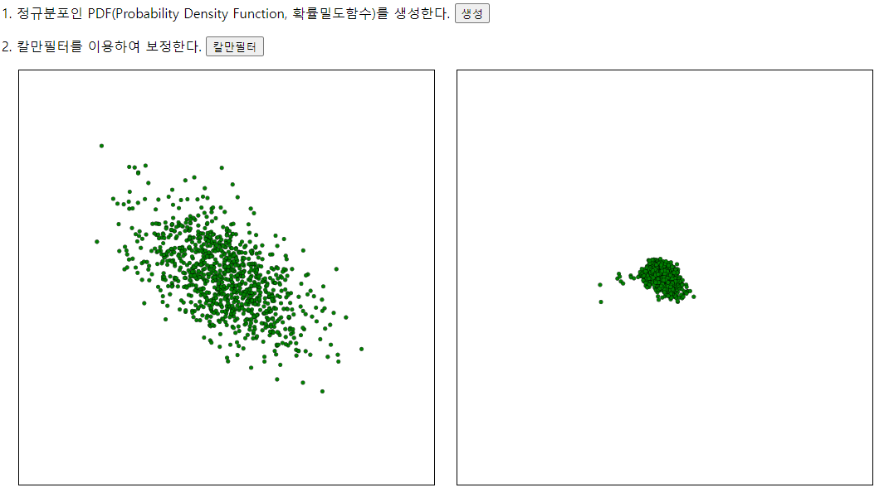

### Go 언어를 이용한 칼만필터 구현 및 시뮬레이션
gin 프레임워크를 이용하여 웹을 통해 칼만 필터를 시뮬레이션해 보기 위해 개발

##### 칼만필터란? 
https://jbground.tistory.com/82

#### 칼만 필터 점화식

#### 구현 과정
1. 칼만 필터를 적용할 수 있는 정규 분포인 x, y 좌표 데이터 생성
2. x, y 데이터에 칼만 필터를 적용하여 노이즈를 제거한 특정 좌표를 추정할 수 있는지 확인

#### 구현 및 시뮬레이션 결과

